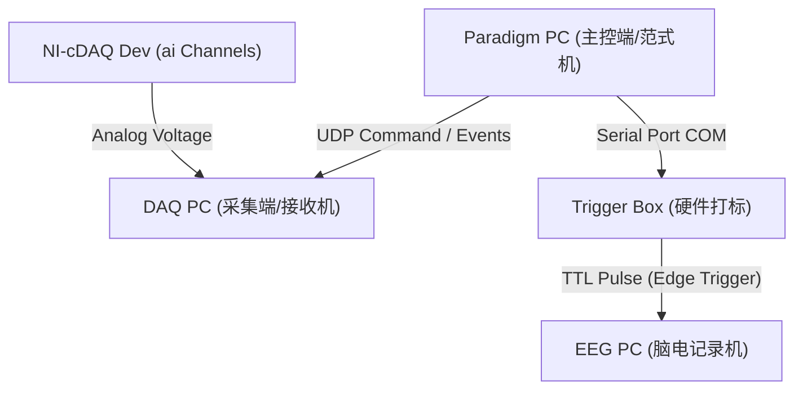

# EOG & EEG Distributed Paradigm System (Basic Branch)

This is the **Basic** branch of the EOG & EEG distributed acquisition system. It contains the core three-machine architecture components, visual guide paradigms, configuration files, and Neuracle API trigger integration using fully portable relative paths.

Released under the **MIT License** (v1.0 Release).

---

## 1. System Architecture (三机架构)

The system is distributed across three machines to ensure low temporal jitter and isolated data processing:



### 1.1 Paradigm PC (主控端/范式机)
- **Role**: Drives the graphical GUI guides, receives user settings, controls timing, and issues triggers.
- **Key Scripts**:
  - `眼动范式.py` / `眼动范式2.py`: The visual paradigms. One is the grid motion, and the other is the sequential segment guide.
  - `common.py`: Manages network parameters, triggers, local event logs, and high-precision timers.
  - `setup_gui.py`: Dialogue box GUI for subject input and hardware channel selection.
  - `trigger_device.py`: Low-level serial wrapper to communicate with the Neuracle Trigger Box.

### 1.2 DAQ PC (采集端/接收机)
- **Role**: Receives start/stop commands via UDP, controls NI-cDAQ modules, and saves raw high-frequency signals.
- **Key Scripts**:
  - `DAQ_GUI_server.py`: Listens for UDP commands and records analog waveforms to binary files.

### 1.3 EEG PC (脑电记录机)
- **Role**: Records standard EEG waveforms in BDF format. Receives precise hardware TTL triggers from the Paradigm PC through the Trigger Box.

---

## 2. File Directory structure

```directory
Simple_EOG_Paradigm/
├── config.json               # System configuration parameters
├── trigger_mappings.json      # Maps paradigm events to EEG hardware triggers
├── LICENSE                   # MIT License
├── README.md                 # Description of the Basic branch
├── common.py                 # Common UDP & hardware trigger helpers
├── setup_gui.py              # Patient info and setup GUI
├── trigger_device.py         # Neuracle serial port wrapper
├── DAQ_GUI_server.py         # cDAQ UDP receiver and bin writer
├── 眼动范式.py               # Grid paradigm
├── 眼动范式2.py              # Five-segment action guide paradigm
└── neuracle_lib/             # Neuracle API library (relative import)
    ├── __init__.py
    ├── dataServer.py
    ├── readbdfdata.py
    └── triggerBox.py
```

---

## 3. Data Structure Description (数据结构说明)

### 3.1 DAQ Binary Data (`.bin` files)
- **File Location**: Saved in `EOG/DAQ_Data_YYYYMMDD_HHMMSS.bin` on the DAQ PC.
- **Format**: Sequential dump of double-precision floating-point numbers (`float64`, 8 bytes per value).
- **Structure**: Written in block chunks read from the cDAQ module. The structure is interleaved chunk-by-chunk:
  $$\text{bin\_data} = [\text{chunk}_0, \text{chunk}_1, \dots, \text{chunk}_{M-1}]$$
  where each chunk contains channels sequentially:
  $$\text{chunk}_j = [\text{ch}_{0, \text{samples}}, \text{ch}_{1, \text{samples}}, \dots, \text{ch}_{C-1, \text{samples}}]$$
- **Reconstruction Formula (Python)**:
  ```python
  import numpy as np
  raw_data = np.fromfile(bin_path, dtype=np.float64)
  # 1. Reshape to (num_chunks, num_channels, chunk_size)
  raw_data = raw_data.reshape(num_chunks, num_channels, chunk_size)
  # 2. Transpose to (num_channels, num_chunks, chunk_size)
  raw_data = raw_data.transpose(1, 0, 2)
  # 3. Flatten chunk dimensions to obtain continuous channels
  reconstructed_data = raw_data.reshape(num_channels, -1)
  ```

### 3.2 DAQ Metadata (`_meta.json` files)
- **File Location**: Saved in `EOG/DAQ_Data_YYYYMMDD_HHMMSS_meta.json`.
- **Properties**:
  - `rate`: Sampling rate of NI-cDAQ (default 10000 Hz).
  - `chunk_size`: Read buffer size (default 500).
  - `total_samples`: Total recorded samples per channel.
  - `task_name`: Segment task label (e.g. `眼动网格_X负半轴`).
  - `channels`: Hardware channels used (e.g., `['ai0', 'ai2', 'ai6']`).
  - `channel_mappings`: Channel aliases (e.g., `{'hEOG': 'ai0', 'vEOG_right': 'ai2', 'vEOG_left': 'ai6'}`).
  - `events`: List of events logged when UDP packets were received. Each item contains:
    - `event`: Event string (e.g. `T_1_R0C0_TARGET_START`).
    - `system_time`: UNIX timestamp on the DAQ PC (seconds).
    - `daq_sample_index`: Sample offset from the start of this segment recording.

### 3.3 Trigger Mappings (`trigger_mappings.json`)
Maps text events (e.g. `"T_1_R0C0_TARGET_START"`) to hardware integer trigger values (e.g. `12`) written to the BDF EEG file. This file is shared between the Paradigm PC and analytical software.

### 3.4 Paradigm CSV Logs (`.csv` files)
- **File Location**: Saved in `logs/[subject_name]_[task]_[time].csv` on the Paradigm PC.
- **Fields**:
  - `时间戳`: Date time string (YYYY-MM-DD HH:MM:SS.FFF)
  - `相对时间(ms)`: Milliseconds since paradigm launch
  - `试次号`: Trial index
  - `网格行` / `网格列`: Active row/col indices (0-indexed)
  - `物理X` / `物理Y`: Screen pixels of the target
  - `事件类型`: Event keyword (e.g. `TARGET_BEFORE`, `TARGET_AFTER`, `REST_START`)
  - `描述`: Human readable description

---

## 4. Neuracle API Trigger Setup

The `trigger_device.py` is configured with relative imports:
```python
DEFAULT_API_DIRS = [
    Path(__file__).parent / "neuracle_lib",
    Path(__file__).parent,
]
```
No absolute local machine directories are hardcoded. If you run the paradigm, it searches for `neuracle_lib` in the local project directory automatically.

---

## 5. License
Licensed under the **MIT License**. See `LICENSE` for details.
