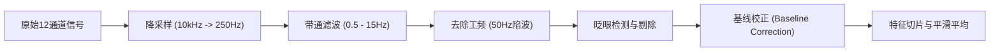

# Simple EOG Gaze Calibration Paradigm: Data Structure Parsing & Analysis Framework

本报告针对 `Simple_EOG_Paradigm` 实验项目生成的典型数据进行多维度解析，并为其核心任务——**5×5 空间坐标注视与眼电 (EOG) 信号的建模**，提供一套从信号预处理、特征提取到数学回归建模的完整后续分析框架。

---

## 一、 系统架构与产出数据概述

系统由**范式呈现端 (Paradigm PC)** 与**数据采集端 (cDAQ PC)** 通过局域网双机联动运行。

```mermaid
graph TD
    subgraph Paradigm PC (Windows)
        A["眼动范式.py (Tkinter UI)"] -->|本地保存| B["行为日志: logs/*.csv"]
        A -->|UDP 发送 CMD_START / CMD_STOP / Event Mark| C["cDAQ PC"]
    end
    subgraph cDAQ PC (Lab PC)
        C -->|接收 UDP 指令| D["DAQ_GUI_server.py (PyQt5)"]
        D -->|硬件配置与采集| E["NI cDAQ 采集箱"]
        E -->|高速连续采样| D
        D -->|数据存盘| F["原始波形: EOG/*.bin"]
        D -->|元数据存盘| G["打标及描述: EOG/*_meta.json"]
    end
```

### 实验产出文件清单
当单次实验安全完成后，系统在两台 PC 上分别生成以下三类核心文件：

| 文件类别 | 典型路径 | 生成端 | 数据内容与用途 |
| :--- | :--- | :--- | :--- |
| **行为日志 (CSV)** | `logs/[Subject]_[Task]_[Time].csv` | 范式呈现端 | 记录每个 Trial 的刺激呈现时间戳、红点屏幕坐标、网格行列号以及事件类型（REST/TARGET）。 |
| **原始信号 (BIN)** | `EOG/DAQ_Data_[Time].bin` | 数据采集端 | 以二进制 `float64` 格式顺序存储的多通道连续电压信号（包括 EOG 信号与数字同步通道）。 |
| **会话元数据 (JSON)** | `EOG/DAQ_Data_[Time]_meta.json` | 数据采集端 | 记录采集参数（采样率、通道数等）以及与采集点数精确对齐的 UDP 事件打标列表。 |

---

## 二、 典型数据结构解析

### 1. 行为日志 CSV 结构
行为日志记录了范式端的时间轴和视觉刺激坐标。

*   **表头字段**：`时间戳,相对时间(ms),试次号,网格行,网格列,物理X,物理Y,事件类型,描述`
*   **每 Trial 事件序列**：
    1.  `REST_START` / `REST_END`：提示受试者看中心十字（基线期，中心坐标 `1280, 720`，耗时 2.0s）。
    2.  `TARGET_START` / `TARGET_END`：红点亮起（注视期，坐标为 5x5 网格的 24 个点之一，耗时 1.0s）。

### 2. 会话描述文件 JSON (`_meta.json`)
此文件是解析 BIN 文件的“钥匙”，也是数据对齐的核心。

```json
{
    "rate": 10000,
    "chunk_size": 500,
    "total_samples": 240000,
    "task_name": "眼动网格",
    "channels": [
        "cDAQ1Mod8/ai0", "cDAQ1Mod8/ai2", "cDAQ1Mod8/ai6",
        "cDAQ1Mod1/ai7", "cDAQ1Mod1/ai16", "cDAQ1Mod1/ai17", 
        "cDAQ1Mod1/ai18", "cDAQ1Mod1/ai19", "cDAQ1Mod1/ai20", 
        "cDAQ1Mod1/ai21", "cDAQ1Mod1/ai22", "cDAQ1Mod1/ai23"
    ],
    "events": [
        {
            "event": "T_1_R0C0_REST_START",
            "system_time": 17839300.12,
            "daq_sample_index": 41830
        }
    ]
}
```
> [!IMPORTANT]
> **`daq_sample_index`** 字段指示了当采集端收到 UDP 事件广播时，NI 采集任务**已经采集到的硬件采样点总数**。它是将行为事件映射到连续时间信号的**最可靠纽带**，避免了双机系统的时间漂移。

### 3. 原始信号二进制 BIN 文件
`.bin` 文件是无格式的连续二进制流，存储全部 12 个通道的电压信号。

*   **数值类型**：`double` (IEEE 754 双精度浮点数，8 字节/点)。
*   **物理通道分配 (Channel Map)**：
    *   **通道 0 (ai0)**：**hEOG** (水平眼电信号，差分，电压范围 $\pm 0.2\text{V}$)。
    *   **通道 1 (ai2)**：**vEOG** (垂直眼电信号，差分，电压范围 $\pm 0.2\text{V}$)。
    *   **通道 2 (ai6)**：**Ref** (基准通道/参考电极信号)。
    *   **通道 3 (ai7)**：**Sync** (硬件同步触发边沿信号，RSE，电压范围 $\pm 5.0\text{V}$)。
    *   **通道 4-11 (ai16-ai23)**：**Data Bits [0-7]** (8位并行数字信号，用于硬件编码，电平 $>2.0\text{V}$ 为 1，否则为 0)。

*   **内存块拼接机制 (C-order Serialization)**：
    采集端以每块（Chunk）`chunk_size = 500`（50ms数据）为单位从 NI 驱动中读取，并使用 Numpy 将二维矩阵 `(NUM_CHANNELS, chunk_size)` 转换为一维字节流写入磁盘。
    
    其重组和还原逻辑如下：
    
    $$\text{Raw Binary (1D Array)} \xrightarrow{\text{Reshape}} (B, C, S) \xrightarrow{\text{Transpose}} (C, B, S) \xrightarrow{\text{Reshape}} (C, N_{total})$$
    
    其中，$B$ 为完整块数，$C = 12$ 为通道数，$S = 500$ 为单块点数，$N_{total} = B \times S$ 为总采样点数。

#### Python 数据重组还原代码
```python
# /// script
# dependencies = ["numpy"]
# ///
import numpy as np

def reconstruct_daq_data(bin_path, num_chans=12, chunk_size=500):
    raw_data = np.fromfile(bin_path, dtype=np.float64)
    # 丢弃损坏的末尾数据块
    block_len = num_chans * chunk_size
    num_blocks = len(raw_data) // block_len
    raw_data = raw_data[:num_blocks * block_len]
    
    # 重构维度并提取
    reshaped = raw_data.reshape((num_blocks, num_chans, chunk_size))
    transposed = reshaped.transpose(1, 0, 2)
    reconstructed = transposed.reshape(num_chans, -1) # 维度: (12, N_samples)
    return reconstructed
```

#### MATLAB 数据重组还原代码
```matlab
function final_data = reconstruct_daq_data(bin_path, num_chans, chunk_size)
    fid = fopen(bin_path, 'r');
    raw = fread(fid, Inf, 'double');
    fclose(fid);
    
    points_per_chunk = chunk_size * num_chans;
    num_full_chunks = floor(length(raw) / points_per_chunk);
    raw = raw(1 : num_full_chunks * points_per_chunk);
    
    % 重组三维并 permute [Buffer, NumChunks, Channels]
    data_raw = reshape(raw, points_per_chunk, []); 
    M = reshape(data_raw, chunk_size, num_chans, []);
    M = permute(M, [1, 3, 2]); 
    final_data = reshape(M, [], num_chans); % 维度: (N_samples, 12)
end
```

---

## 三、 同步机制与对齐方案

系统采用**基于网络 (UDP) 的事件同步方案**对齐数据与行为标记：

1.  **UDP 对齐方案（唯一启用）**：
    *   在范式播放刺激的瞬间，范式主程序通过局域网 UDP 广播发送标记字符串，如 `T_1_R0C1_TARGET_START`。
    *   采集器底层接收到该 UDP 包后，瞬时截取当前 NI Task 的采样点计数并记为 `daq_sample_index`，随后同事件字符串一起保存在元数据中。
    *   **分析方法**：后续分析读取 `_meta.json`，直接利用 `daq_sample_index` 字段定位连续信号的绝对采样点偏移，进行切片。

2.  **物理并行电平对齐（本项目未使用）**：
    *   虽然底层的硬件端口 `ai7` (Sync) 和 `ai16-ai23` (8位 Trigger 数据通道) 已经分配并在 NI Task 中初始化采样，但**在当前实验中未连接物理并行电平 Trigger 设备，全部的对齐分析纯粹依靠 UDP 网络时间戳**。因此，在后续数据重组中，通道 3 到 11 的数据在建模时无需解析，可以直接忽略。

---

## 四、 信号预处理与质量管理管道

眼电信号十分微弱（通常为几十微伏至几毫伏），易受极化漂移、工频干扰和肌电噪声的影响。因此在空间建模前，必须经过严格的预处理：



### 1. 降采样与带通滤波
EOG 的有效眼动信号频率主要集中在 $15\text{Hz}$ 以下。
*   **降采样**：将 $10\text{kHz}$ 的信号降采样至 $250\text{Hz}$，可极大提升信噪比（SNR）并降低计算量。
*   **滤波**：使用 4 阶 Butterworth **双向零相位滤波器** (Zero-phase filtering, `filtfilt`) 进行 $0.5\text{Hz} - 15\text{Hz}$ 带通滤波。
    *   *高通截止频率 (0.5Hz)*：彻底去除电极接触引起的极化基线漂移。
    *   *低通截止频率 (15Hz)*：滤除高频噪声和面部肌电 (EMG) 伪迹。

### 2. 眨眼伪迹剔除 (Blink Detection)
眨眼会导致 $vEOG$ 通道产生瞬时、高幅度的尖峰（通常 $>50\mu\text{V}$，持续 200-400ms）。
*   **检测方法**：对带通滤波后的 $vEOG$ 求一阶差分，设置阈值检测尖峰位置。
*   **处理策略**：在空间校准建模中，若在 `TARGET_START` 后的注视段内检测到眨眼，应直接标记并剔除该 Trial，避免其对注视坐标的破坏。

### 3. 基线漂移校正 (Baseline Correction)
基线随着实验时间推移会产生慢性漂移（由汗液、皮肤阻抗、电极相对位移引起）。
对于每一次 Trial（第 $i$ 次试次，网格坐标 $r, c$）：
1.  **提取基线电压**：在受试者凝视屏幕中心十字的区间（`REST_START` + 500ms 至 `REST_END`），计算 $hEOG$ 和 $vEOG$ 的均值电压：
    
    $$V_{base\_h}^{(i)}, \quad V_{base\_v}^{(i)}$$

2.  **提取注视稳定期电压**：红点亮起后，受试者需要大约 200-300ms 的反应时间（扫视延迟）眼球才能移动到目标点。
    *   **建议分析窗**：切取 `TARGET_START` **延后 350ms 至 1000ms**（共 650ms）的波形。
    *   计算该稳定窗内的均值电压：
    
        $$V_{target\_h}^{(i)}, \quad V_{target\_v}^{(i)}$$

3.  **求取相对电压变化量（用于建模的特征向量值）**：
    
    $$\Delta V_h^{(i)} = V_{target\_h}^{(i)} - V_{base\_h}^{(i)}$$
    
    $$\Delta V_v^{(i)} = V_{target\_v}^{(i)} - V_{base\_v}^{(i)}$$

---

## 五、 5×5 空间注视与 EOG 建模分析框架

我们需要构建一个映射函数，将经过处理得到的眼动电压变化特征向量 $(\Delta V_h, \Delta V_v)$ 映射到屏幕上的物理坐标 $(X, Y)$，或 5x5 的网格行列位置 $(Row, Col)$。

### 1. 数据特征空间映射关系
在理想状态下，眼球偏转角度 $\theta$ 与 EOG 电压变化量呈准线性关系。5x5 的网格点在物理空间分布呈矩形阵列，其映射在 EOG 电压的特征空间中也应当维持类似的拓扑结构。

*   **输入特征矩阵**：$\mathbf{V} = [\Delta V_h, \Delta V_v] \in \mathbb{R}^{M \times 2}$ （$M$ 为有效 Trial 总数，最大为 24点 $\times$ 2重复 = 48）。
*   **目标矩阵**：$\mathbf{X} = [X_{pixel}, Y_{pixel}] \in \mathbb{R}^{M \times 2}$。

---

### 2. 建模方案选择

#### 方案 A：双变量多项式回归 (Bivariate Polynomial Regression) - **推荐首选**
由于眼睛移动时存在水平和垂直通道之间的串扰 (Cross-talk)，并且屏幕是平面的，导致边缘视角投影呈非线性。可以使用二次多项式拟合非线性映射：

$$X = \beta_{x0} + \beta_{x1} \Delta V_h + \beta_{x2} \Delta V_v + \beta_{x3} \Delta V_h^2 + \beta_{x4} \Delta V_v^2 + \beta_{x5} (\Delta V_h \cdot \Delta V_v)$$

$$Y = \beta_{y0} + \beta_{y1} \Delta V_h + \beta_{y2} \Delta V_v + \beta_{y3} \Delta V_h^2 + \beta_{y4} \Delta V_v^2 + \beta_{y5} (\Delta V_h \cdot \Delta V_v)$$

*   **求解方法**：利用标准最小二乘法 (OLS) 直接求出系数矩阵 $\boldsymbol{\beta}_x, \boldsymbol{\beta}_y$。
*   **优势**：计算简单，对小样本量（如 5x5 网格的 48 个样本）泛化性极好，不易过拟合，且物理可解释性强。

#### 方案 B：几何转角模型 (Geometric Gaze Model)
将像素坐标 $(X, Y)$ 先转换成视线偏转角 $(\theta_x, \theta_y)$。
设受试者双眼距离屏幕正中心的垂直距离为 $D$（通常约为 $600\text{mm}$），屏幕像素分辨率为 $W \times H$，物理尺寸为 $W_{mm} \times H_{mm}$：

$$\theta_x = \arctan\left( \frac{(X - X_{center}) \times \frac{W_{mm}}{W}}{D} \right), \quad \theta_y = \arctan\left( \frac{(Y - Y_{center}) \times \frac{H_{mm}}{H}}{D} \right)$$

建立线性偏转模型：

$$\theta_x = k_x \Delta V_h + c_x, \quad \theta_y = k_y \Delta V_v + c_y$$

拟合求出系数 $k_x, c_x, k_y, c_y$ 后。当有新眼电信号输入时，先求 $\theta$，再反求屏幕物理坐标：

$$X = X_{center} + \frac{D \cdot \tan(\theta_x)}{\text{pixel\_size\_x}}, \quad Y = Y_{center} + \frac{D \cdot \tan(\theta_y)}{\text{pixel\_size\_y}}$$

#### 方案 C：支持向量回归 (SVR with RBF Kernel)
当用户的面部结构、电极贴敷导致极度非线性，或者头部存在轻微位移时，可使用机器学习中的 SVR 进行非线性拟合。
*   **输入**：$(\Delta V_h, \Delta V_v)$。
*   **输出**：分别构建 $hEOG \to X$ 和 $vEOG \to Y$ 的两个 RBF-SVR 模型。
*   **注意事项**：需要通过网格搜索 (Grid Search) 精细调节超参数 $C$ 和 $\gamma$，以防出现过度扭曲。

---

### 3. 模型验证与可视化评估 (Verification & Visualization)

为了验证建模精确度，应设计如下评估框架：

1.  **交叉验证 (Cross Validation)**：
    使用**留一法 (Leave-One-Out CV)** 或 **K折交叉验证 (K-Fold CV)**。每次排除 1 到 2 个网格点，用剩余点训练模型，并在排除的点上测试预测偏差。
2.  **性能指标**：
    *   **均方根误差 (RMSE)**（单位：像素 或 毫米）：
        
        $$\text{RMSE}_X = \sqrt{\frac{1}{M}\sum_{i=1}^M (X_{true} - X_{pred})^2}$$
        
    *   **平均视解角误差 (Angular Error)**（单位：度 $^\circ$）：眼动追踪领域的金标准。临床上要求 $\text{Error} < 1.0^\circ$ 为优秀，小于 $2.0^\circ$ 为可用。
3.  **可视化方法**：
    *   **EOG 特征状态空间图 (State-Space Plot)**：以 $\Delta V_h$ 为 X 轴，$\Delta V_v$ 为 Y 轴绘制所有 24 个校准点（除中心点）的散点图。正常的眼动应该呈现出**清晰、规整的 5x5 网格拓扑网（中间空洞）**。如果拓扑发生严重扭曲，说明信号质量差或眼外肌动力不足。
    *   **注视投影失真网格图 (Gaze Distortion Grid)**：将真实的 5x5 网格（蓝色线）与模型预测出的 5x5 网格（红色线，将重复试次平均）画在同一个屏幕坐标系内，用线段连接相同点，直观展示系统的标定残差分布与空间非线性失真。

---

### 4. 离线建模数据集制备脚本 (MATLAB)

我们已编写并集成了完整的批处理与高鲁棒性数据集构建脚本 [Prepare_EOG_Dataset.m](file:///d:/OneDrive/Data/DoCs/Tools/Simple_EOG_Paradigm/Prepare_EOG_Dataset.m)，用于将多个志愿者/Session 的原始数据进行滤波、去噪、修复和打包。

#### 脚本执行流程：
1. **自动文件扫描**：扫描 `EOG/` 目录下所有的 `*_meta.json` 与对应的 `.bin` 文件。
2. **多通道恢复与降采样**：将原始 C-order 排布的 10kHz 数据解包并降采样至 250Hz。
3. **带通滤波**：使用 4 阶 Butterworth 双向零相位滤波器过滤高低频噪声。
4. **Trial 截取与基线校准**：基于 UDP 时间戳切片，减去 preceding baseline 期间的均值电压。
5. **眨眼伪迹鲁棒处理**：
   - 采用 $5.0 \times \text{std}(\text{diff}(vEOG))$ 和 $4.0 \times \text{std}(vEOG)$ 的组合阈值检测眨眼点，并向前后膨胀 100ms。
   - 若眨眼点占比 $\le 40\%$，使用分段三次 Hermite 多项式插值（`pchip`）进行信号修复。
   - 若眨眼点占比 $> 40\%$ 或受试者瞬时扰动过大，将该试次直接标记为无效 (IsValid = 0)，防止其噪声污染标定模型。
6. **多 Session 汇总与存储**：将所有有效 Trial 聚合，自动计算网格的物理像素目标坐标，并导出为 `Compiled_EOG_Dataset.mat` 包含：
   - `X_train` (`[N_valid, 2]`): 包含 $[\Delta V_h, \Delta V_v]$ 电压特征。
   - `Y_train` (`[N_valid, 2]`): 对应红点的物理像素坐标 $[X_{pixel}, Y_{pixel}]$。
   - `EOG_Dataset`: 完整的汇总表格（包含 SubjectID、IsValid、BlinkStatus 等，方便离线分析诊断）。

#### 典型的 MATLAB 二次多项式回归建模示例
您可以在 MATLAB 中运行如下代码，加载该数据集并拟合出空间注视模型：

```matlab
% 1. 加载制备好的数据集
load('Compiled_EOG_Dataset.mat'); % 载入 X_train, Y_train

% 2. 构造双变量二次多项式特征: [1, H, V, H^2, V^2, H*V]
H = X_train(:, 1);
V = X_train(:, 2);
num_samples = length(H);

% 特征设计矩阵
A = [ones(num_samples, 1), H, V, H.^2, V.^2, H.*V];

% 3. 最小二乘法求解回归系数 (Beta_x 和 Beta_y)
beta_x = A \ Y_train(:, 1); % 拟合 X 坐标的参数
beta_y = A \ Y_train(:, 2); % 拟合 Y 坐标的参数

% 4. 在训练集上进行模型预测与残差计算
pred_X = A * beta_x;
pred_Y = A * beta_y;

rmse_x = sqrt(mean((Y_train(:, 1) - pred_X).^2));
rmse_y = sqrt(mean((Y_train(:, 2) - pred_Y).^2));

fprintf('二次多项式建模完成：\n');
fprintf('   - 水平方向重构误差 (RMSE_X): %.2f 像素\n', rmse_x);
fprintf('   - 垂直方向重构误差 (RMSE_Y): %.2f 像素\n', rmse_y);

% 5. 绘制标定网格失真图 (True vs. Predicted Gaze Mesh)
% （此处可以对每个网格点的重复试次预测值求平均，以连线展示 5x5 网格形变图）
```
